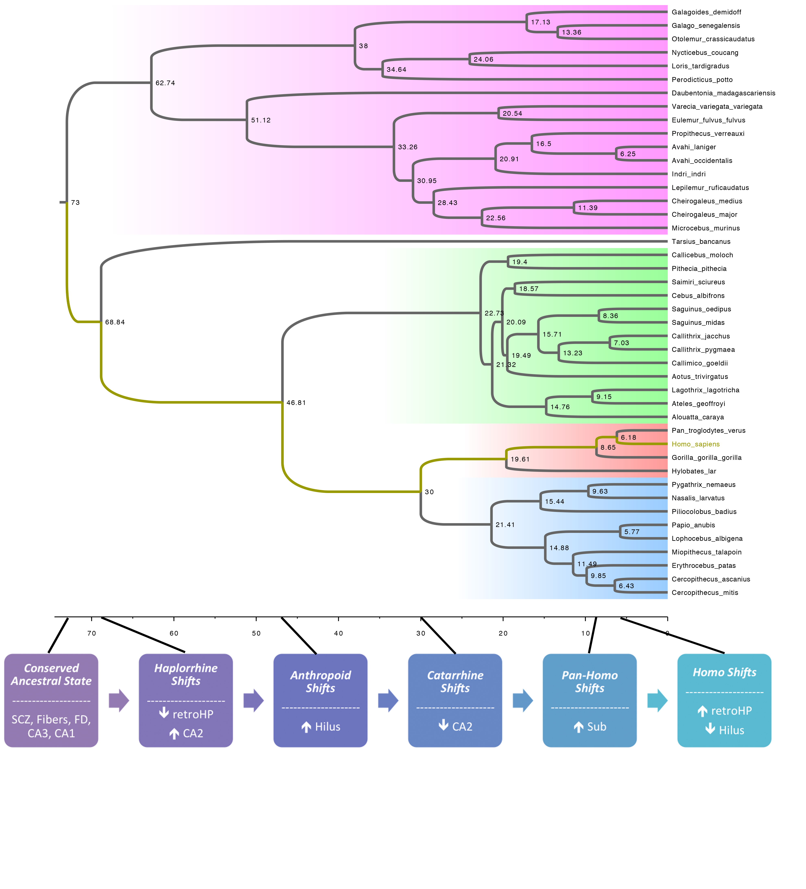

# Hippo_Eco

An interactive report of the results from this study is available here:  
https://bschilder.github.io/Hippo_Eco/HPsubfield_eco.html

## Title:  
### Evolutionary selective pressures dramatically expanded and reorganized the human hippocampal complex  

## Authors:    
### Brian M. Schilder *1, Heywood Petry 2, Patrick R. Hof 3  
1 Department of Neuroscience, Icahn School of Medicine at Mount Sinai, New York, NY 10029  
2 Department of Psychological & Brain Sciences, University of Louisville, Louisville, KY 40292  
3 Fishberg Department of Neuroscience and Friedman Brain Institute, Icahn School of Medicine at Mount Sinai, New York, NY 10029  

## Abstract  
The hippocampal complex (HC) is central to long-term memory storage and retrieval as well as spatial navigation across many species. While often assumed to be largely conserved, the HC shows considerable interspecies variation in both morphology and function. Notably, humans appear to have greatly enhanced or possibly unique HC-mediated capacities such as constructive episodic simulation. Only few studies have investigated the evolution of the primate HC or its functionally distinct subregions, leaving the extent to which humans differ from non-human primates (NHPs) poorly known. We therefore statistically tested for evidence of selective shifts across primate evolution using a sample of HC subregion volume estimates across 44 species spanning 14 taxonomic families. In addition, to determine what ecological pressures may have contributed to such selective shifts, we also tested the relationships between these volumetric estimates and HC-related ecological variables (Diet Breadth, Population Density, Group Size, Home Range Size, and Residual Home Range) in a series of phylogenetically informed multiple regressions. We found that many different selective shifts have occurred in the course of primate evolution, some which appear to be at least partially driven by ecological pressures. However, the unprecedented shifts in both HC size and subregion organization observed in the human lineage have rendered modern humans with a HC that is a clear outlier amongst all NHP species investigated here. Given the extensive literature confirming the relationship between HC size and certain cognitive functions, these selective shifts are very likely to be related to human-specific capacities for HC-mediated functions.  

  
  
  
### The deep evolutionary history of the human hippocampus    

